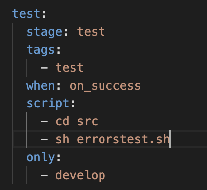

##### Подними виртуальную машину *Ubuntu Server 22.04 LTS*.

##### Скачай и установи на виртуальную машину **gitlab-runner**.

##### Запусти **gitlab-runner** и зарегистрируй его для использования в текущем проекте (*DO6_CICD*).
 

### Part 2. Сборка

#### Напиши этап для **CI** по сборке приложений из проекта *C2_SimpleBashUtils*.

##### В файле _gitlab-ci.yml_ добавь этап запуска сборки через мейк файл из проекта _C2_.

##### Файлы, полученные после сборки (артефакты), сохрани в произвольную директорию со сроком хранения 30 дней.

 

***result***

 

#### Напиши этап для **CI**, который запускает скрипт кодстайла (*clang-format*).

 

***result***

 

#### Напиши этап для **CI**, который запускает твои интеграционные тесты из того же проекта.

##### В пайплайне отобрази вывод, что интеграционные тесты успешно прошли / провалились.

 

***result***

 

##### Подними вторую виртуальную машину *Ubuntu Server 22.04 LTS*.

#### Напиши этап для **CD**, который «разворачивает» проект на другой виртуальной машине.

 

***result***

 

##### Как сделал? 

1. Поднял и настроил машины, закинул их в одну сеть, настроив файл /etc/netplan/00-installer-config.yaml на обеих машинах.

2. Далее создал на пользователя gitlab-runner на виртуальной машине. Создал ключ доступа, скопировал его и настроил доступ по ssh.

Для этого использовал команды:
sudo su gitlab-runner - переключился на пользователя
- ssh-keygen -t rsa -b 2048 - сгенерировал ключ
- ssh-copy-id cd@192.168.100.15 - скопировал на вторую виртуальную машину
- ssh cd@192.168.100.15 - подключился удаленно ко второй машине

Далее на виртуальной машине cd@192.168.100.15 так же сгенерировал ключ и настроил доступ.
- ssh-keygen -t rsa -b 2048
- ssh-copy-id cd@192.168.100.14
- sudo chown -R $(whoami) /usr/local/bin

> sudo chown -R $(whoami) /usr/local/bin изменяет владельца и группу для всех файлов и каталогов в директории /usr/local/bin на текущего пользователя, который исполняет эту команду. (chown - change owner)

### Part 6. Дополнительно. Уведомления

`-` Здесь написано, что твое следующее задание выполняется специально для нобелевских лауреатов. Здесь не сказано, за что они получили премию, но точно не за умение работать с **gitlab-runner**.

**== Задание ==**

##### Настрой уведомления о успешном/неуспешном выполнении пайплайна через бота с именем «[твой nickname] DO6 CI/CD» в *Telegram*.

- Текст уведомления должен содержать информацию об успешности прохождения как этапа **CI**, так и этапа **CD**.
- В остальном текст уведомления может быть произвольным.

 

***result***

 