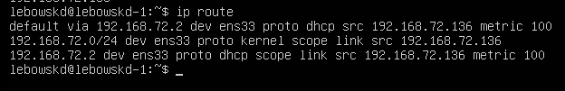
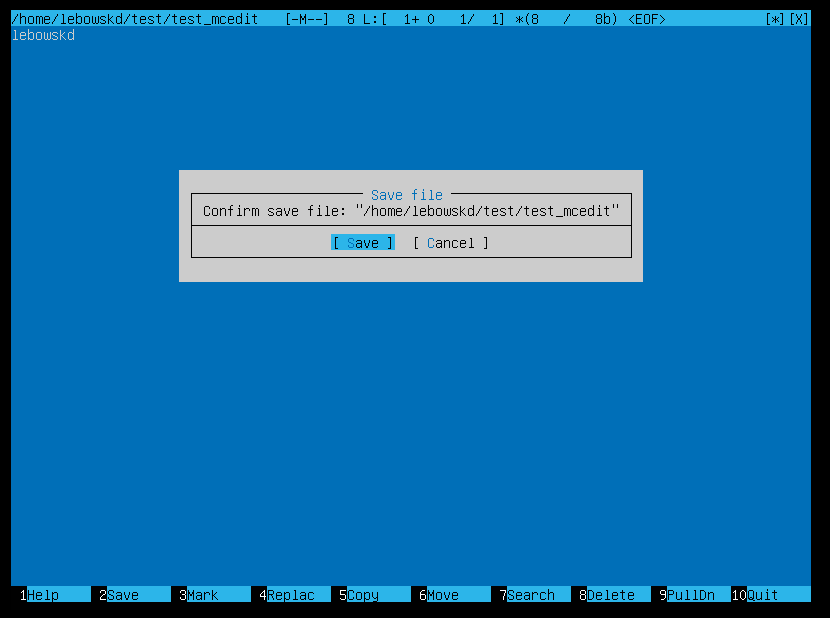
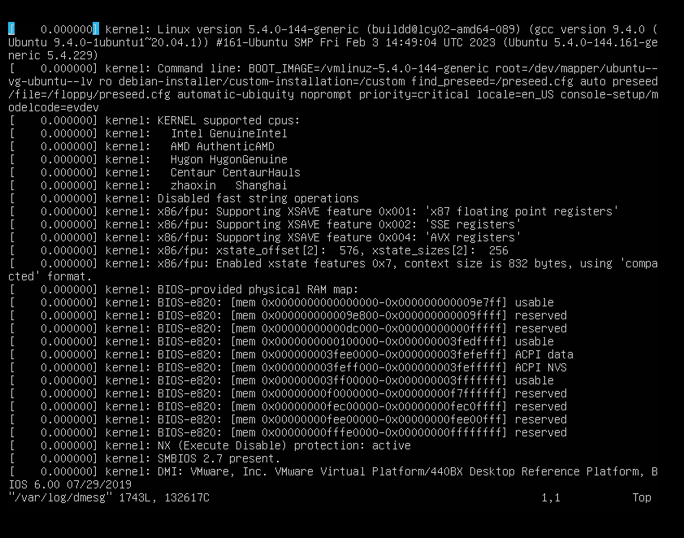

## Part 1. Установка ОС

Сообщение с установленной версией Linux: 

## Part 2. Создание пользователя

## Part 3. Настройка сети ОС

lo или local loopback (локальная петля). Служит для подключения по сети к этому же компьютеру и не требует дополнительной настройки;

Dynamic Host Configuration Protocol (DHCP) — автоматический предоставляет IP адреса и прочие настройки сети (маску сети, шлюз и т.п) компьютерам и различным устройствам в сети.

## Part 4. Обновление ОС

Обновить системные пакеты до последней на момент выполнения задания версии

## Part 5. Использование команды **sudo**

Sudo — это утилита, предоставляющая привилегии root для выполнения административных операций в соответствии со своими настройками. Она позволяет легко контролировать доступ к важным приложениям в системе. По умолчанию, при установке Ubuntu первому пользователю (тому, который создаётся во время установки) предоставляются полные права на использование sudo. Т.е. фактически первый пользователь обладает той же свободой действий, что и root. 

## Part 6. Установка и настройка службы времени

Настроить службу автоматической синхронизации времени.
Вывод следующей команды должен содержать NTPSynchronized=yes: timedatectl show 

## Part 7. Установка и использование текстовых редакторов 

Установить текстовые редакторы VIM (+ любые два по желанию NANO, MCEDIT, JOE и т.д.)
sudo apt install vim
sudo apt install nano
sudo apt install mcedit
Используя каждый из трех выбранных редакторов, создайте файл test_X.txt, где X -- название редактора, в котором создан файл. Напишите в нём свой никнейм, закройте файл с сохранением изменений.
Используя каждый из трех выбранных редакторов, откройте файл на редактирование, отредактируйте файл, заменив никнейм на строку "21 School 21", закройте файл без сохранения изменений.
Используя каждый из трех выбранных редакторов, отредактируйте файл ещё раз (по аналогии с предыдущим пунктом), а затем освойте функции поиска по содержимому файла (слово) и замены слова на любое другое

    vim test_VIM.txt
    Режим редактирования: I
    Выйти из режима редактирования: esc
    Выход с охранением: :wq
    Выход без сохранения: :q
    Поиск: /<текст, который хотим найти>
    Замена: :s/<что хотим изменить>/<на что хотим заменить>

    mcedit test_mcedit.txt
    Выход с охранением: F2 (yes) + F10
    Выход без сохранения: F10(no)
    Поиск: F7 + <текст который ищем> + <ок>
    Замена: F4 + <что хотим изменить> + <на что хотим заменить> + replace

    nano test_NANO.txt
    Выход с охранением: CTRL + x, затем y b enter
    Выход без сохранения: CTRL + x, затем n
    Поиск: CTRL + W, затем enter (alt + w для перехода к след. вхождению, ctrl + c для преращения поиска)
    Замена: CTRL + + <что хотим изменить + enter> + <на что хотим заменить + enter> + A(для замены все вхождения) или y и n по отдельности

## Part 8. Установка и базовая настройка сервиса **SSHD**

sudo apt-get install ssh
sudo apt install openssh-server 

sudo systemctl enable ssh
systemctl status ssh 

sudo vim /etc/ssh/sshd_config 

systemctl restart sshd

ps (показывает запущенные процессы, выполняемые пользователем в окне терминала);
ps -e или ps -A (Чтобы просмотреть все запущенные процессы);
ps -d (Чтобы показать все процессы, кроме лидеров сессии);
ps -d -N (можно инвертировать вывод с помощью переключателя -N. Например, если хочу вывести только лидеров сеансов)
ps T (увидеть только процессы, связанные с этим терминалом);
ps r (просмотреть все работающие (running) процессы);
ps -p 'pid' (если вы знаете идентификатор процесса PID, вы можете просто использовать следующую команду, для вывода процесса с этим 'pid');
ps -p 'pid1' 'pid2'
ps U 'userlist' (найти все процессы, выполняемые конкретным пользователем);
ps -ef (получить полный список); 

    -t (--tcp) отображает соедниеня только по tcp
    -a (--all) вывод всех активных подключений TCP
    -n (--numeric) вывод активных подключений TCP с отображением адресов и номеров портов в числовом формате
    Proto: Название протокола (протокол TCP или протокол UDP);
    recv-Q: очередь получения сети
    send-Q: Сетевая очередь отправки
    Local Address адрес локального компьтера и используемы номер порта
    Foreign Address адрес и номер удаленного компьтера к которомц подключен сокет
    State состояние сокетв
    0.0.0.0 означает IP-адрес на локальной машине

## Part 9. Установка и использование утилит **top**, **htop**

## Part 10. Использование утилиты **fdisk**

## Part 11. Использование утилиты **df** 

## Part 12. Использование утилиты **du**

## Part 13. Установка и использование утилиты **ncdu**

## Part 14. Работа с системными журналами

## Part 15. Использование планировщика заданий **CRON**

